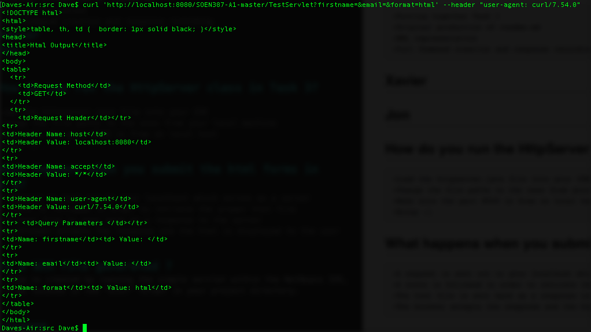
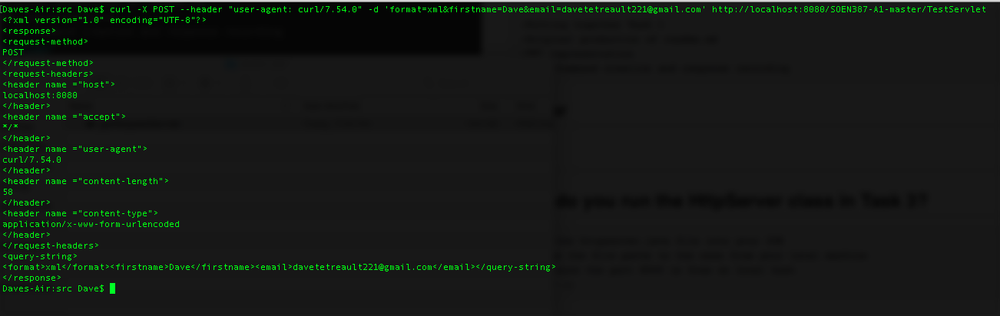
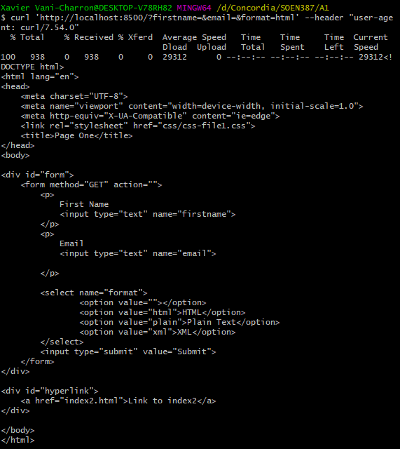
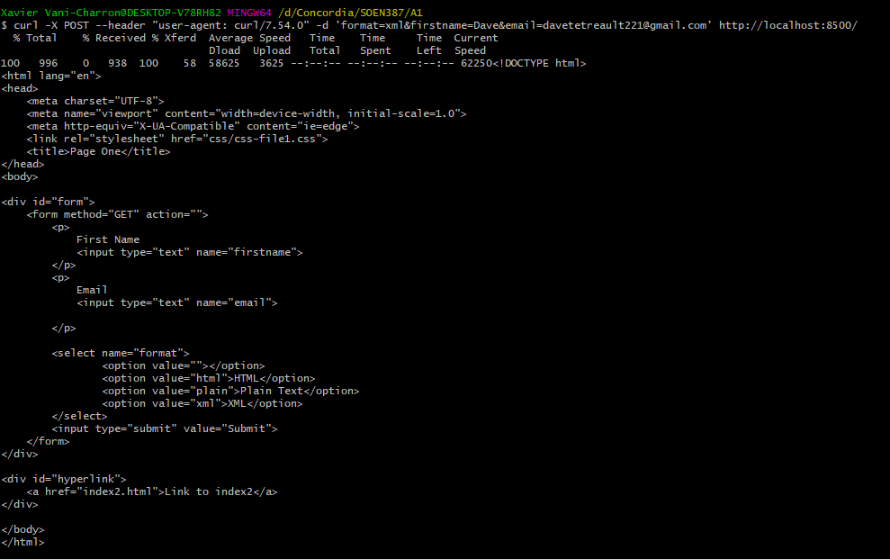

# Contributions 

## Dave Tetreault 
	-Putting together Task 1
	-Original production of readme.md
	-XML representation
	-Curl Command creation and response recording 
## Xavier
## Jon

## How do you run the HttpServer class in Task 3?

	-Load the httpserver.java file into your IDE
	-Change the file paths to the ones from your local machine
	-Make sure the port 8500 is free on local host 
	-Enjoy :)

## What happens when you submit the html forms in Task 3?
	-A request is sent out to your localhost which serves as a server
	-A route is followed in order to retrieve the proper html file
	-The html file is sent back as a response to the server
	-The broswer accepts the response and the html is displayed to the user 
	

## Is a WAR file generated ?
A WAR file is created by running the simple servlet within the NetBeans IDE, it will be located in the "dist" folder in your project directory. 

##cURL Outputs
	-GET Method envoked on servlet

	-POST Method envoked on servlet

	-GET Method envoked on HTTP server index.html

	
	-POST Method envoked on HTTP server 

## License
[MIT](https://choosealicense.com/licenses/mit/)